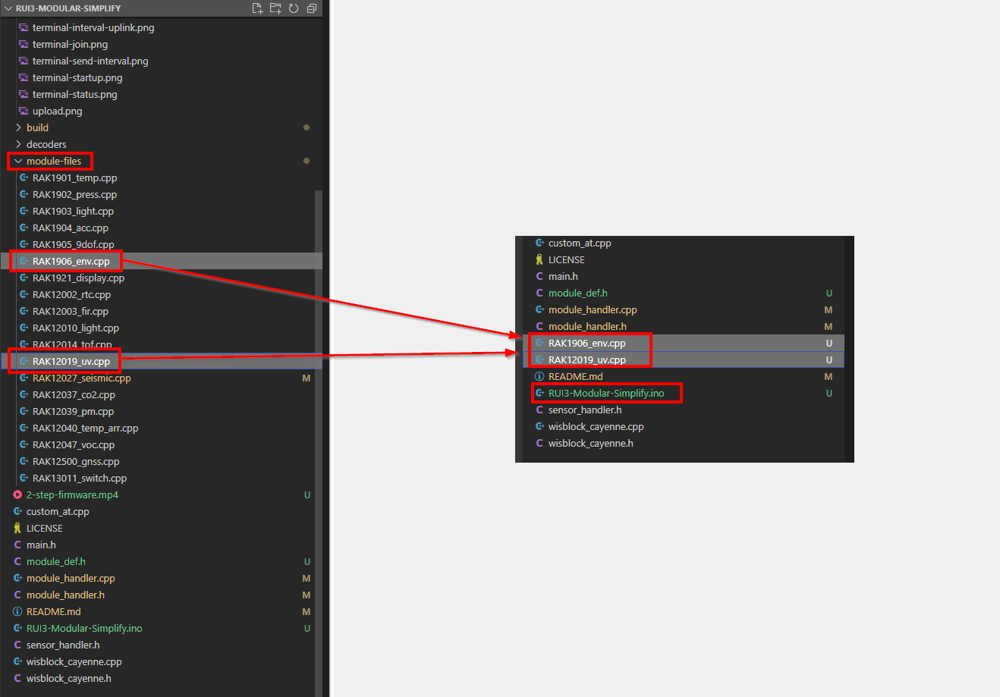

# RUI3-Modular
This example is an approach to provide a quick start with RUI3 and WisBlock Sensor modules. With ~~6~~ 5 simple steps you can build a sensor application and send data packets to a LoRaWAN server or over LoRa P2P.

This code is _**Work in progress**_ and far from finished. But it can give a first start how to use RUI3.     
     
# Content
- [How does it work](#how-does-it-work)
   - [Step-by-step tutorial](#step-by-step-tutorial)
   - [Build an application with two sensors](#build-an-application-with-two-sensors)
- [Hardware supported](#hardware-supported)
   - [_LIMITATIONS_](#limitations)
- [Software used](#software-used)
- [Packet data format](#packet-data-format)
- [Device setup](#device-setup)
   - [Custom AT commands](#custom-at-commands)
- [Video](#video)

|  |  |  |    
| :-: | :-: | :-: |     

----

# How does it work

This repository has ready to use files for many [WisBlock Modules](https://docs.rakwireless.com/Product-Categories/WisBlock/). The main application **`main.cpp`** is designed to handle (most) of the different modules automatically. Enabled modules are included in the scheduled sensor readings and their data is added to the uplink payload automatically.     
Only a few steps are required to add a module to the application.     
The complete LoRaWAN communication is handled by RUI3, setup is done with WisToolBox or AT commands.     

## Step-by-step tutorial

This is a generic description for the six steps required to build an application. See below an example for two WisBlock modules.

1) Copy the **`.cpp`** file for the required module(s) from the folder **`module-files`** to the project folder.     
~~2) Edit the file **`module-handler.h`** and enable the module(s) by uncommenting the includes for the required modules. Check the required libraries, you can install them with the ArduinoIDE Library Manager by clicking on the link behind the include.~~ Not required anymore. Compiler directives can now detect which modules are being used.     
2) ~~3)~~ Compile and flash the application to the WisBlock RAK4631-R, RAK3372 or WisDuo RAK4630, RAK3172
3) ~~4)~~ Setup the devices LoRa mode (LoRaWAN or LoRa P2P) and the required credentials with [WisToolBox](https://docs.rakwireless.com/Product-Categories/Software-Tools/WisToolBox/Overview/) or with a terminal application and the [RUI3 AT commands](https://docs.rakwireless.com/RUI3/Serial-Operating-Modes/AT-Command-Manual/)
4) ~~5)~~ In case of LoRaWAN, join the network from [WisToolBox](https://docs.rakwireless.com/Product-Categories/Software-Tools/WisToolBox/Overview/) or with a terminal application and the [RUI3 AT command](https://docs.rakwireless.com/RUI3/Serial-Operating-Modes/AT-Command-Manual/) [**`AT+JOIN=1:1`**](https://docs.rakwireless.com/RUI3/Serial-Operating-Modes/AT-Command-Manual/#at-join)    
5) ~~6)~~ Check the uplinks on the LoRaWAN server

## Build an application with two sensors

In this short tutorial an application is created for the WisBlock modules [RAK1906 environment sensor](https://docs.rakwireless.com/Product-Categories/WisBlock/RAK1906/Overview/) and the [RAK12019 UV light](https://docs.rakwireless.com/Product-Categories/WisBlock/RAK12019/Overview) sensor.

### Step 1

Select the 2 files required in the **`module-files`** folder and copy them into the project folder:


### ~~Step 2~~

Not required anymore. Compiler directives can now detect which modules are being used.    

~~Enable the modules in the file **`module_handler.h`** by uncommenting the required includes for the RAK1906 and RAK12019

Then save the file **`module_handler.h`**.~~

### Step 2 ~~Step 3~~

Select the WisBlock Core or WisDuo module you want to run the application on and the COM port it is connected to. Then compile and upload the code.

|  |  |  |    
| :-: | :-: | :-: |

### Step 3 ~~Step 4~~

Open a terminal application and connect to the device. Reset the device and you can see the first output of the device with some debug messages. As you can see, it already shows that it found the two WisBlock modules:


To make it easier, the **`RUI3-Modular`** has a custom AT command to show some of the settings. Type **`ATC+STATUS=?`** (use **`ATC`** for custom commands) to see the status:


This device is already setup for LoRaWAN OTAA and has the proper DevEui, AppEUI and AppKey. The LoRaWAN region is as well set correct for my country to **`AS923-3`**.     
If changes are required, they can be done with the [RUI3 AT commands](https://docs.rakwireless.com/RUI3/Serial-Operating-Modes/AT-Command-Manual/).

### Step 4 ~~Step 5~~

I assume here the device is already setup in a LoRaWAN server and a gateway is in range.

To join the LoRaWAN network send [**`AT+JOIN=1`**](https://docs.rakwireless.com/RUI3/Serial-Operating-Modes/AT-Command-Manual/#at-join) to the device and wait for it to join.


Once the device could successfully join the network, use another custom AT command to setup the automatic send interval for the uplink packets.     
The custom AT command **`ATC+SENDINT=?`** shows the current interval, which is by default 0 seconds. Use **`ATC+SENDINT=30`** to set the send interval to 30 seconds.


Now the device starts sending an uplink packet every 30 seconds:


### Step 5 ~~Step 6~~

In the LoRaWAN server check the incoming uplinks (here Chirpstack is used, but other LNS have similar outputs).    
Here we can see the join request/accept and then the incoming uplink packets:


As the uplink packets are encoded in an extended Cayenne-LPP format (see [Packet data format](#packet-data-format)), it is easy to see the uplink data with one of the available packet decoders, e.g. the [Chirpstack decoder](./decoders/Chirpstack-Ext-LPP-Decoder.js)


----

# Video 

https://user-images.githubusercontent.com/512690/207828565-40556d17-0945-4564-a631-31174d528bd8.mp4

----

# Hardware supported
| Module | Function | Supported |
| --     | --       | --          |
| [RAK4631-R](https://docs.rakwireless.com/Product-Categories/WisBlock/RAK4631-R/Overview/) ⤴️ | WisBlock Core module with RUI3| ✔ |
| [RAK3372](https://docs.rakwireless.com/Product-Categories/WisBlock/RAK3372/Overview/) ⤴️ | WisBlock Core module with RUI3| ✔ |
| [RAK19007](https://docs.rakwireless.com/Product-Categories/WisBlock/RAK19007/Overview/) ⤴️ | WisBlock Base board | ✔ |
| [RAK19003](https://docs.rakwireless.com/Product-Categories/WisBlock/RAK19003/Overview/) ⤴️ | WisBlock Mini Base board | ✔ |
| [RAK19001](https://docs.rakwireless.com/Product-Categories/WisBlock/RAK19001/Overview/) ⤴️ | WisBlock Fullsize Base board | ✔ |
| [RAK1901](https://docs.rakwireless.com/Product-Categories/WisBlock/RAK1901/Overview/) ⤴️ | WisBlock Temperature and Humidty Sensor | ✔ |
| [RAK1902](https://docs.rakwireless.com/Product-Categories/WisBlock/RAK1902/Overview/) ⤴️ | WisBlock Barometer Pressure Sensor | ✔ |
| [RAK1903](https://docs.rakwireless.com/Product-Categories/WisBlock/RAK1903/Overview/) ⤴️ | WisBlock Ambient Light Sensor | ✔ |
| [RAK1904](https://docs.rakwireless.com/Product-Categories/WisBlock/RAK1904/Overview/) ⤴️ | WisBlock Acceleration Sensor (used for GNSS solutions) | ✔ |
| [RAK1905](https://docs.rakwireless.com/Product-Categories/WisBlock/RAK1905/Overview/) ⤴️ | WisBlock 9 DOF sensor | ✔ |
| [RAK1906](https://docs.rakwireless.com/Product-Categories/WisBlock/RAK1906/Overview/) ⤴️ | WisBlock Environment Sensor | ✔ |
| [~~RAK1910~~](https://docs.rakwireless.com/Product-Categories/WisBlock/RAK1910/Overview/) ⤴️ | WisBlock GNSS Sensor | Work in progress |
| [RAK1921](https://docs.rakwireless.com/Product-Categories/WisBlock/RAK1921/Overview/) ⤴️ | WisBlock OLED display | ✔ |
| [RAK12002](https://docs.rakwireless.com/Product-Categories/WisBlock/RAK12002/Overview/) ⤴️ | WisBlock RTC module | ✔ |
| [RAK12003](https://docs.rakwireless.com/Product-Categories/WisBlock/RAK12003/Overview/) ⤴️ | WisBlock FIR sensor | ✔ |
| [~~RAK12004~~](https://docs.rakwireless.com/Product-Categories/WisBlock/RAK12004/Overview/) ⤴️ | WisBlock MQ2 Gas sensor | Work in progress |
| [~~RAK12008~~](https://docs.rakwireless.com/Product-Categories/WisBlock/RAK12008/Overview/) ⤴️ | WisBlock MG812 CO2 Gas sensor | Work in progress |
| [~~RAK12009~~](https://docs.rakwireless.com/Product-Categories/WisBlock/RAK12009/Overview/) ⤴️ | WisBlock MQ3 Alcohol Gas sensor | Work in progress |
| [RAK12010](https://docs.rakwireless.com/Product-Categories/WisBlock/RAK12010/Overview/) ⤴️ | WisBlock Ambient Light sensor | ✔ |
| [RAK12014](https://docs.rakwireless.com/Product-Categories/WisBlock/RAK12014/Overview/) ⤴️ | WisBlock Laser ToF sensor | ✔ |
| [RAK12019](https://docs.rakwireless.com/Product-Categories/WisBlock/RAK12019/Overview/) ⤴️ | WisBlock UV Light sensor | ✔ |
| [~~RAK12025~~](https://docs.rakwireless.com/Product-Categories/WisBlock/RAK12025/Overview/) ⤴️ | WisBlock Gyroscope sensor | Work in progress |
| [RAK12027](https://docs.rakwireless.com/Product-Categories/WisBlock/RAK12027/Overview/) ⤴️ | WisBlock Seismic sensor | ✔ |
| [~~RAK12023/RAK12035~~](https://docs.rakwireless.com/Product-Categories/WisBlock/RAK12023/Overview/) ⤴️ | WisBlock Soil Moisture and Temperature sensor | Work in progress |
| [RAK12037](https://docs.rakwireless.com/Product-Categories/WisBlock/RAK12037/Overview/) ⤴️ | WisBlock CO2 sensor | ✔ |
| [RAK12040](https://docs.rakwireless.com/Product-Categories/WisBlock/RAK12040/Overview/) ⤴️ | WisBlock AMG8833 temperature array sensor | ✔ |
| [RAK12047](https://docs.rakwireless.com/Product-Categories/WisBlock/RAK12047/Overview/) ⤴️ | WisBlock VOC sensor | ✔ |
| [RAK12500](https://docs.rakwireless.com/Product-Categories/WisBlock/RAK12500/Overview/) ⤴️ | WisBlock GNSS Sensor | ✔ |
| [~~RAK14002~~](https://docs.rakwireless.com/Product-Categories/WisBlock/RAK14002/Overview/) ⤴️ | WisBlock 3 button touch pad | Work in progress |
| [~~RAK14003~~](https://docs.rakwireless.com/Product-Categories/WisBlock/RAK14003/Overview/) ⤴️ | WisBlock LED bar display | Work in progress |
| [~~RAK14008~~](https://docs.rakwireless.com/Product-Categories/WisBlock/RAK14008/Overview/) ⤴️ | WisBlock Gesture sensor | Work in progress |


## _LIMITATIONS_     
- The RAK1904 module _**MUST**_ be installed in     
    - Slot C of RAK19007, RAK19007 or RAK19001
    - Slot A of RAK19003
- The RAK1905 module _**MUST**_ be installed in     
    - Slot C of RAK19007, RAK19007 or RAK19001
    - Slot A of RAK19003

----

# Software used
## IDE
- [ArduinoIDE](https://www.arduino.cc/en/software) ⤴️
- [RAK-STM32-RUI](https://github.com/RAKWireless/RAKwireless-Arduino-BSP-Index) ⤴️
- [RAK-nRF52-RUI](https://github.com/RAKWireless/RAKwireless-Arduino-BSP-Index) ⤴️
## LoRaWAN payload creation
- [CayenneLPP](https://github.com/ElectronicCats/CayenneLPP) ⤴️
- [ArduinoJson](https://registry.platformio.org/libraries/bblanchon/ArduinoJson) ⤴️
## Sensor libraries
- [RAKwireless RAK1901 Temperature and Humidity SHTC3](https://downloads.rakwireless.com/RUI/RUI3/Library/RAKwireless_RAK1901_Temperature_and_Humidity_SHTC3.zip) (manual from ZIP) ⤴️
- [Adafruit LPS2X](https://github.com/adafruit/Adafruit_LPS2X) ⤴️
- [ClosedCube OPT3001](https://github.com/beegee-tokyo/ClosedCube_OPT3001_Arduino) ⤴️
- [Sparkfun LIS3DH](https://github.com/sparkfun/SparkFun_LIS3DH_Arduino_Library) ⤴️
- [MPU9250](https://github.com/wollewald/MPU9250_WE) ⤴️
- [Adafruit BME680 Library](https://github.com/adafruit/Adafruit_BME680) ⤴️
- [nRF52_OLED](https://github.com/beegee-tokyo/nRF52_OLED) ⤴️
- [Melopero RV3028](https://github.com/melopero/Melopero_RV-3028_Arduino_Library) ⤴️
- [SparkFun MLX90632 Noncontact Infrared Temperature Sensor](https://github.com/sparkfun/SparkFun_MLX90632_Arduino_Library) ⤴️
- [RAKwireless VEML Light Sensor](https://github.com/RAKWireless/RAK12010-VEML7700-Library) ⤴️
- [Pololu VL53L0X](https://github.com/pololu/vl53l0x-arduino) ⤴️
- [RAK12019_LTR390_UV_Light](https://github.com/RAKWireless/RAK12019_LTR390) ⤴️
- [RAK12027-D7S](https://github.com/RAKWireless/RAK12027-D7S) ⤴️
- [SparkFun SCD30 Arduino Library](https://github.com/sparkfun/SparkFun_SCD30_Arduino_Library) ⤴️
- [RAK12039-PMSA003I](https://github.com/RAKWireless/RAK12039-PMSA003I) ⤴️
- [Melopero AMG8833](https://github.com/melopero/Melopero_AMG8833) ⤴️
- [Sensirion Core](https://github.com/Sensirion/arduino-core) ⤴️
- [Sensirion Gas Index Algorithm](https://github.com/Sensirion/gas-index-algorithm) ⤴️
- [Sensirion I2C SGP40](https://github.com/Sensirion/arduino-i2c-sgp40) ⤴️
- [SparkFun u-blox GNSS Arduino Library](https://github.com/sparkfun/SparkFun_u-blox_GNSS_Arduino_Library) ⤴️

----

# Packet data format
The packet data is made compatible with the extended Cayenne LPP encoding from [ElectronicCats/CayenneLPP](https://github.com/ElectronicCats/CayenneLPP) ⤴️.    
The content of the packet depends on the modules installed on the WisBlock Base Board:     

| Data                      | Channel # | Channel ID | Length   | Comment                                           | Required Module   | Decoded Field Name |
| --                        | --        | --         | --       | --                                                | --                | --                 |
| Battery value             | 1         | _**116**_  | 2 bytes  | 0.01 V Unsigned MSB                               | RAK4631           | voltage_1          |
| Humidity                  | 2         | 104        | 1 bytes  | in %RH                                            | RAK1901           | humidity_2         |
| Temperature               | 3         | 103        | 2 bytes  | in °C                                             | RAK1901           | temperature_3      | 
| Barometric Pressure       | 4         | 115        | 2 bytes  | in hPa (mBar)                                     | RAK1902           | barometer_4        |
| Illuminance               | 5         | 101        | 2 bytes  | 1 lux unsigned                                    | RAK1903           | illuminance_5      |
| Humidity 2                | 6         | 104        | 1 bytes  | in %RH                                            | RAK1906           | humidity_6         |
| Temperature 2             | 7         | 103        | 2 bytes  | in °C                                             | RAK1906           | temperature_7      | 
| Barometric Pressure 2     | 8         | 115        | 2 bytes  | in hPa (mBar)                                     | RAK1906           | barometer_8        |
| Gas Resistance 2          | 9         | 2          | 2 bytes  | 0.01 signed (kOhm)                                | RAK1906           | analog_9           |
| GNSS stand. resolution    | 10        | 136        | 9 bytes  | 3 byte lon/lat 0.0001 °, 3 bytes alt 0.01 meter   | RAK12500          | gps_10             |
| GNSS enhanced resolution  | 10        | _**137**_  | 11 bytes | 4 byte lon/lat 0.000001 °, 3 bytes alt 0.01 meter | RAK12500          | gps_10             |
| Soil Temperature          | 11        | 103        | 2 bytes  | in °C                                             | RAK12023/RAK12035 | temperature_11     |
| Soil Humidity             | 12        | 104        | 1 bytes  | in %RH                                            | RAK12023/RAK12035 | humidity_12        |
| Soil Humidity Raw         | 13        | 2          | 2 bytes  | 0.01 signed                                       | RAK12023/RAK12035 | analog_in_13       |
| Soil Data Valid           | 14        | 102        | 1 bytes  | bool                                              | RAK12023/RAK12035 | presence_14        |
| Illuminance 2             | 15        | 101        | 2 bytes  | 1 lux unsigned                                    | RAK12010          | illuminance_15     |
| VOC                       | 16        | _**138**_  | 2 bytes  | VOC index                                         | RAK12047          | voc_16             |
| MQ2 Gas                   | 17        | 2          | 2 bytes  | 0.01 signed                                       | RAK12004          | analog_in_17       |
| MQ2 Gas Percentage        | 18        | _**120**_  | 1 bytes  | 1-100% unsigned                                   | RAK12004          | percentage_18      |
| MG812 Gas                 | 19        | 2          | 2 bytes  | 0.01 signed                                       | RAK12008          | analog_in_19       |
| MG812 Gas Percentage      | 20        | _**120**_  | 1 bytes  | 1-100% unsigned                                   | RAK12008          | percentage_20      |
| MQ3 Alcohol Gas           | 21        | 2          | 2 bytes  | 0.01 signed                                       | RAK12009          | analog_in_21       |
| MQ3 Alcohol Gas Perc.     | 22        | _**120**_  | 1 bytes  | 1-100% unsigned                                   | RAK12009          | percentage_22      |
| ToF distance              | 23        | 2          | 2 bytes  | 0.01 signed                                       | RAK12014          | analog_in_23       |
| ToF Data Valid            | 24        | 102        | 1 bytes  | bool                                              | RAK12014          | presence_24        |
| Gyro triggered            | 25        | _**134**_  | 6 bytes  | 2 bytes per axis, 0.01 °/s                        | RAK12025          | gyrometer_25       |
| Gesture detected          | 26        | 0          | 1 byte   | 1 byte with id of gesture                         | RAK14008          | digital_in_26      |
| LTR390 UVI value          | 27        | 2          | 2 byte   | 0.01 signed                                       | RAK12019          | analog_in_27       | 
| LTR390 UVS value          | 28        | 101        | 2 bytes  | 1 lux unsigned                                    | RAK12019          | illuminance_28     | 
| INA219 Current            | 29        | 2          | 2 byte   | 0.01 signed                                       | RAK16000          | analog_29          | 
| INA219 Voltage            | 30        | 2          | 2 byte   | 0.01 signed                                       | RAK16000          | analog_30          | 
| INA219 Power              | 31        | 2          | 2 byte   | 0.01 signed                                       | RAK16000          | analog_31          | 
| Touchpad left             | 32        | 102        | 1 bytes  | bool                                              | RAK14002          | presence_32        | 
| Touchpad middle           | 33        | 102        | 1 bytes  | bool                                              | RAK14002          | presence_33        | 
| Touchpad right            | 34        | 102        | 1 bytes  | bool                                              | RAK14002          | presence_34        | 
| SCD30 CO2 concentration   | 35        | 125        | 2 bytes  | 1 ppm unsigned                                    | RAK12037          | concentration_35   |
| SCD30 temperature         | 36        | 103        | 2 bytes  | in °C                                             | RAK12037          | temperature_36     |
| SCD30 humidity            | 37        | 104        | 1 byte   | in %RH                                            | RAK12037          | humidity_37        |
| MLX90632 sensor temp      | 38        | 103        | 2 bytes  | in °C                                             | RAK12003          | temperature_38     |
| MLX90632 object temp      | 39        | 103        | 2 bytes  | in °C                                             | RAK12003          | temperature_39     |
| PM 1.0 value              | 40        | 103        | 2 bytes  | in ug/m3                                          | RAK12003          | voc_40             |
| PM 2.5 value              | 41        | 103        | 2 bytes  | in ug/m3                                          | RAK12003          | voc_41             |
| PM 10 value               | 42        | 103        | 2 bytes  | in ug/m3                                          | RAK12003          | voc_42             |
| Earthquake event          | 43        | 102        | 1 byte   | bool                                              | RAK12027          | presence_43        |
| Earthquake SI value       | 44        | 2          | 2 bytes  | analog 10 * m/s                                   | RAK12027          | analog_44          |
| Earthquake PGA value      | 45        | 2          | 2 bytes  | analog 10 * m/s2                                  | RAK12027          | analog_45          |
| Earthquake SHUTOFF alert  | 46        | 102        | 1 byte   | bool                                              | RAK12027          | presence_46        |
| Earthquake collapse alert | 47        | 102        | 1 byte   | bool                                              | RAK12027          | presence_47        |

### _REMARK_
Channel ID's in cursive are extended format and not supported by standard Cayenne LPP data decoders.

Example decoders for TTN, Chirpstack, Helium and Datacake can be found in the folder [decoders](./decoders) ⤴️

### _REMARK_
This list is constantly extended as we add new WisBlock modules. Check out the [RAKwireless Standardized Payload](https://github.com/RAKWireless/RAKwireless_Standardized_Payload) repo for the latest status.

# Device setup

The setup of the device (LoRaWAN region, DevEUI, AppEUI, AppKey, ....) can be done with AT commands over the USB port or with [WisToolBox](https://docs.rakwireless.com/Product-Categories/Software-Tools/WisToolBox/Overview/)

**Example AT commands:**
```AT
AT+NWM=1
AT+NJM=1
AT+BAND=10
AT+DEVEUI=1000000000000001
AT+APPEUI=AB00AB00AB00AB00
AT+APPKEY=AB00AB00AB00AB00AB00AB00AB00AB00
ATC+SENDINT=600
```

| Command | Explanation | 
| --- | --- | 
| AT+NWM=1 | set the node into LoRaWAN mode |
| AT+NJM=1 | set network join method to OTAA |
| AT+BAND=10 | set LPWAN region (here AS923-3) see [AT Command Manual](https://docs.rakwireless.com/RUI3/Serial-Operating-Modes/AT-Command-Manual/#at-band) ⤴️ for all regions |
| AT+DEVEUI=1000000000000001 | set the device EUI, best to use the DevEUI that is printed on the label of your WisBlock Core module |
| AT+APPEUI=AB00AB00AB00AB00 | set the application EUI, required on the LoRaWAN server |
| | AT+APPKEY=AB00AB00AB00AB00AB00AB00AB00AB00 | set the application Key, used to encrypt the data packet during network join |
ATC+SENDINT=600 | set the interval the sensor node will send data packets. 600 == 10 x 60 seconds == 10minutes |

### _REMARK_
The manual for all AT commands can be found here: [AT-Command Manual](https://docs.rakwireless.com/RUI3/Serial-Operating-Modes/AT-Command-Manual/) ⤴️

## Custom AT commands
There are additional custom AT commands implemented:

**`ATC+STATUS`** to get the current status of the device.

Example:
```log
atc+status=?

Device Status:
Module: RAK4630
Version: RUI_3.5.2b_175_RAK4631
Send time: 120 s
Network mode LoRaWAN
Network joined
Region: 10
Region: AS923-3
OTAA mode
DevEUI = AC1F09FFFE057110
AppEUI = AC1F09FFFE057110
AppKey = 2B84E0B09B68E5CB42176FE753DCEE79
+EVT:RAK1901 OK
+EVT:RAK1902 OK
+EVT:RAK1903 OK
+EVT:RAK12019 OK
OK
```

**`ATC+SENDINT`** to get and set the automatic send interval

Example:
```log
atc+sendfreq=?

ATC+SENDINT=120s
OK

atc+sendfreq=120
OK
```

If an RAK12002 RTC module is used, the command **`ATC+RTC`** is available to get and set the date time

Example:
```log
atc+rtc=?

ATC+RTC=2000.01.01 0:00:21

atc+rtc=2022:10:21:14:15
OK

atc+rtc=?

ATC+RTC=2022.10.21 14:15:25
```

If an RAK12500 GNSS module is used, the command **`ATC+GNSS`** is available to change GNSS precision and payload format.
It accepts 4 different values:
0 = 4digit prec., 1 = 6digit prec, 2 = Helium Mapper format, 3 = Field Tester format

Example:
```log
atc+gnss=?

GNSS 4 digit Cayenne LPP

atc+gnss=1
OK

```log
atc+gnss=?

GNSS 6 digit extended Cayenne LPP
```

----

